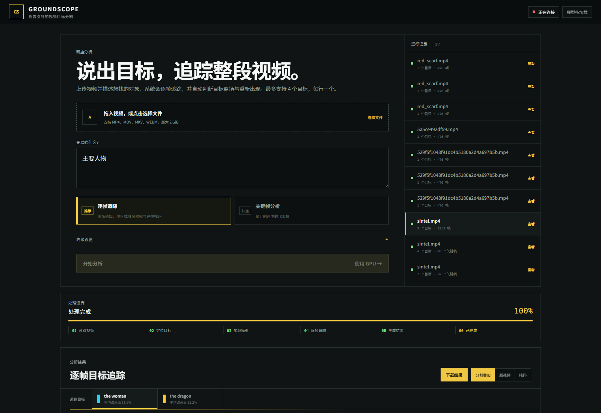
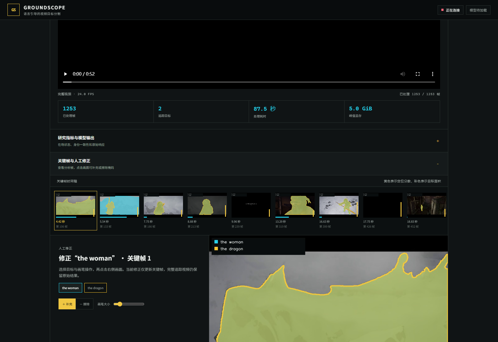
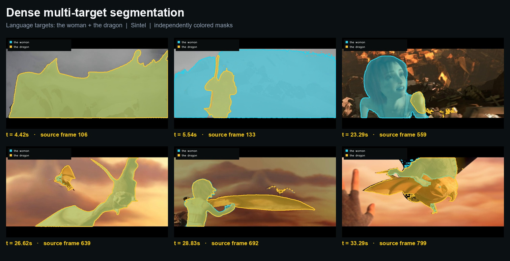
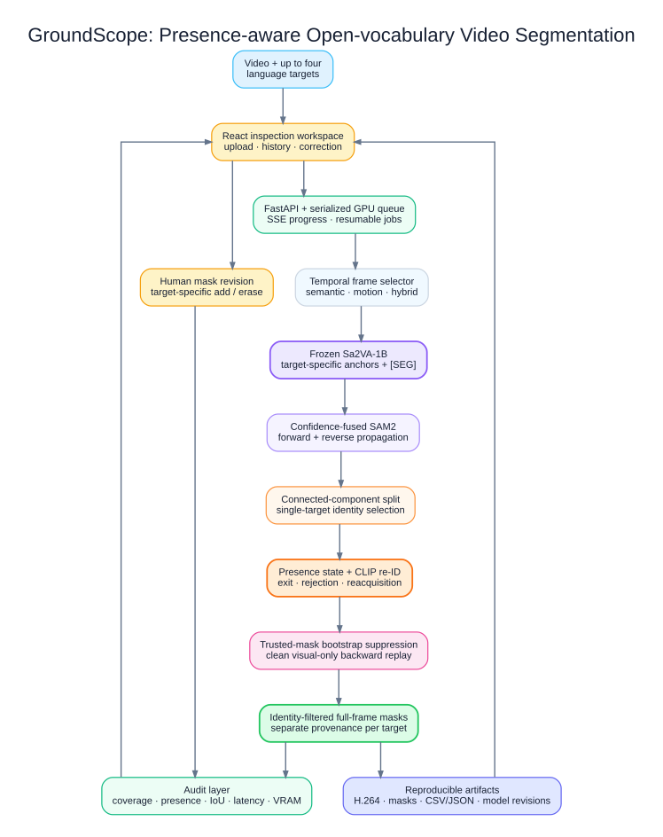
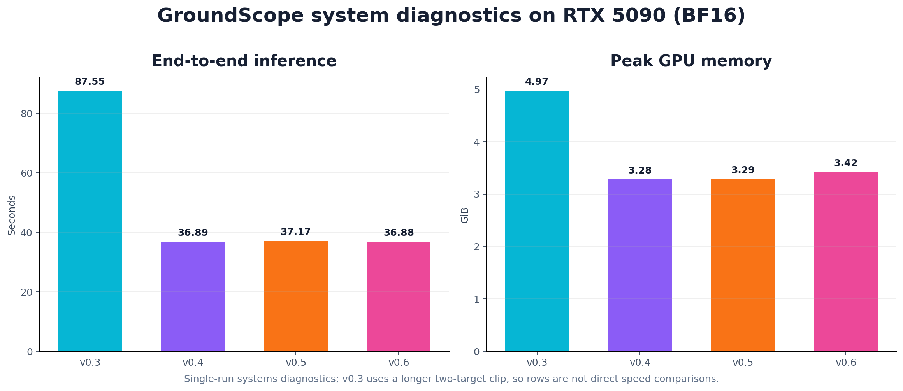
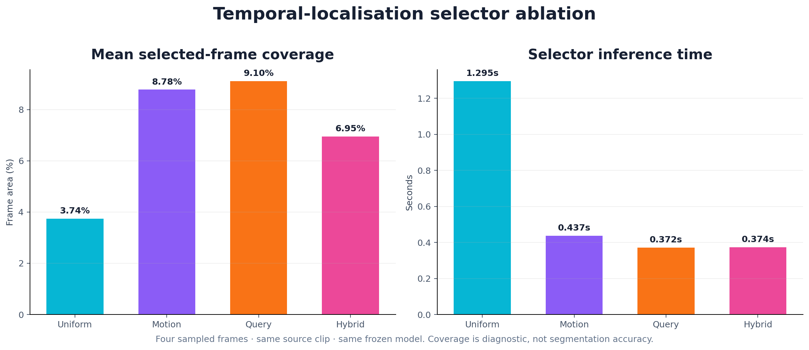

# GroundScope

<div align="center">

**Presence-aware, multi-target, open-vocabulary video segmentation and analysis**

[](https://www.python.org/)
[](https://pytorch.org/)
[](https://github.com/bytedance/Sa2VA)
[](https://github.com/facebookresearch/sam2)
[](https://fastapi.tiangolo.com/)
[](https://react.dev/)
[](#-testing-and-reproducibility)
[](LICENSE)

[平台展示](#-platform) · [Demo 结果](#-demo-results) · [实验数据](#-system-results) · [快速开始](#-quick-start) · [研究计划](docs/RESEARCH_PLAN.md)

</div>

---

GroundScope 是一个基于冻结 [Sa2VA](https://github.com/bytedance/Sa2VA)、[SAM 2](https://github.com/facebookresearch/sam2) 和 CLIP 的开放词汇视频目标分割系统。用户上传视频并用自然语言描述最多四个目标，系统会输出独立着色的逐帧掩码、目标时间线、身份一致性诊断、可复现实验文件，以及浏览器中的人工修正工具。

> GroundScope is an inference-and-systems research project. It does not claim that Sa2VA was retrained, and its current metrics are systems diagnostics rather than ground-truth benchmark accuracy.

## ✨ Project Highlights

- 🎯 **Language-guided multi-target segmentation** — accepts up to four free-form text targets and preserves a separate mask history for each target.
- 👁️ **Dense full-video tracking** — combines target-specific Sa2VA anchors with confidence-fused forward and reverse SAM 2 propagation.
- 🧠 **Presence-aware identity reasoning** — uses a state machine and CLIP appearance prototypes to reject identity jumps, handle disappearance, and support reacquisition.
- 🧩 **Connected-component selection** — splits union masks and retains at most one identity-consistent component per target.
- 🛰️ **Trusted-mask backward replay** — replays a verified visual mask backward without contaminated language-anchor history to recover early misses.
- 📊 **Auditable diagnostics** — exports coverage, presence ratios, rejected components, temporal IoU, latency, peak VRAM, source revision, and model revision.
- 🖥️ **Research-grade inspection UI** — provides uploads, run history, live SSE progress, result playback, keyframe timelines, and per-target mask correction.
- 🧊 **Reproducible artifacts** — produces source/overlay/mask H.264 videos, individual PNG masks, CSV/JSON metrics, and correction logs.
- 🔧 **GPU job architecture** — keeps one BF16 model resident, serializes GPU jobs, and restores completed runs after restart.

## 🖥️ Platform

The bilingual React workspace exposes the complete workflow—from natural-language target entry to experiment history and artifact inspection.



The result workspace presents per-target coverage, processed frames, latency, peak VRAM, keyframe overlays, and a target-specific correction canvas.



## 🚀 Demo Results

The public demo uses the 52.2-second Sintel trailer at 24 FPS with two language targets: `the woman` and `the dragon`. GroundScope generates independently colored masks and propagates them across all 1,253 source frames.



| Demo property | Result |
|:---|---:|
| Language targets | 2 |
| Source / tracked frames | 1,253 / 1,253 |
| Independently addressable target masks | 2,506 |
| Mean consecutive-frame mask IoU | 0.867 |
| End-to-end inference | 87.55 s |
| Peak GPU memory | 4.97 GiB |
| Precision | BF16 |

This is a warm, single-run systems diagnostic, not a ground-truth segmentation score. The demo frames are derived from the Creative Commons Attribution 3.0 licensed Sintel open movie; see [asset attribution](docs/assets/ATTRIBUTION.md).

## 🏗️ System Architecture



```text
Video + language targets
          ↓
React workspace → FastAPI / serialized GPU queue
                          ↓
              temporal frame selection
                          ↓
        target-specific Sa2VA anchors + [SEG]
                          ↓
       confidence-fused forward/reverse SAM 2
                          ↓
       connected components + single identity
                          ↓
       presence state + CLIP appearance re-ID
                          ↓
 trusted-mask suppression + clean backward replay
                          ↓
         identity-filtered full-frame masks
                    ↙               ↘
          metrics and audit      videos / masks / CSV
                    ↘               ↙
             React inspection + correction
```

The editable Graphviz source is available at [`docs/assets/architecture.dot`](docs/assets/architecture.dot), with both SVG and PNG exports versioned for reuse.

## 🧠 Method

1. **Temporal analysis** — sample the video with uniform, motion, semantic-query, or hybrid selection.
2. **Target-specific grounding** — query frozen Sa2VA independently for every target and retain its segmentation embeddings and anchor confidence.
3. **Bidirectional propagation** — run SAM 2 forward and backward from selected anchors, then fuse candidates by confidence.
4. **Component-level identity selection** — split candidate masks into connected regions and compare each region against a CLIP appearance prototype.
5. **Presence state management** — reject low-confidence identity jumps, mark targets absent after departure, and reacquire only when stricter evidence is available.
6. **Clean backward completion** — initialize a fresh SAM 2 state from the earliest trusted visual mask and replay backward to recover frames missed by the language model.
7. **Audit and correction** — export per-frame provenance and metrics; allow a human reviewer to add or erase a target-specific mask region.

## 📊 System Results

Verified on one NVIDIA GeForce RTX 5090 (32 GB, compute capability 12.0):

| Pipeline | Targets | Semantic anchors | Tracked frames | Inference | Peak VRAM |
|:---|---:|---:|---:|---:|---:|
| v0.3 Sa2VA-1B + forward SAM 2 | 2 | 5 shared | 1,253 / 1,253 | 87.55 s | 4.97 GiB |
| v0.4 bidirectional SAM 2 + presence re-ID | 1 | 5 target-specific | 476 / 476 | 36.89 s | 3.28 GiB |
| v0.5 component re-ID + bootstrap suppression | 1 | 5 target-specific | 476 / 476 | 37.17 s | 3.29 GiB |
| v0.6 clean trusted-mask backward replay | 1 | 5 target-specific | 476 / 476 | 36.88 s | 3.42 GiB |



The v0.3 row uses a longer two-target video; v0.4–v0.6 use a 19.0-second single-target regression clip. The rows document tested configurations and must not be interpreted as direct speed comparisons.

### Presence-aware re-identification regression

| Filter | Raw presence | Accepted presence | Identity rejections | Candidate components | Discarded | Backward-refined frames | Temporal IoU |
|:---|---:|---:|---:|---:|---:|---:|---:|
| presence-reid-v1 | 85.1% | 41.8% | 206 | — | — | 0 | 0.895 |
| component-reid-v2 | 71.8% | 30.7% | 194 | 600 | 252 | 0 | 0.952 |
| mask-refine-v3 | 64.5% | 43.3% | 102 | 357 | 49 | 92 | 0.938 |

In the v0.6 regression, the first identity-validated mask is replayed backward in a clean SAM 2 state. The accepted track covers the target's early appearance and remains empty after departure. The second component pass evaluates 357 regions, discards 49 alternatives, and reports no ambiguous frames.

Exact machine-readable tables are versioned under [`results/`](results/).

## 📈 Temporal Selector Ablation

| Selector | Backend | Inference | Mean coverage | Area stability | Temporal IoU | Empty frames |
|:---|:---|---:|---:|---:|---:|---:|
| Uniform | deterministic | 1.295 s | 3.74% | 0.962 | 0.017 | 50% |
| Motion | visual motion | 0.437 s | 8.78% | 0.911 | 0.013 | 25% |
| Query | CLIP ViT-B/32 | 0.372 s | 9.10% | 0.931 | 0.051 | 25% |
| Hybrid | CLIP ViT-B/32 | 0.374 s | 6.95% | 0.914 | 0.002 | 25% |



The four selectors use the same frozen model, source clip, and four-frame budget. Coverage and temporal IoU describe the selected masks; they are not segmentation accuracy.

## 🛠️ Quick Start

### Requirements

- Linux with Python 3.11 or 3.12
- NVIDIA CUDA GPU; BF16-capable hardware is recommended
- Node.js and npm for rebuilding the React frontend
- Sa2VA source and model weights obtained under their upstream terms

### 1. Clone the project

```bash
git clone https://github.com/BoPythonAI/GroundScope.git
cd GroundScope
```

### 2. Install the application

```bash
python3.11 -m venv .venv
source .venv/bin/activate
python -m pip install --upgrade pip
python -m pip install -e '.[dev]'

cd frontend
npm ci
npm run build
cd ..
```

### 3. Prepare the data-disk layout

```text
/root/autodl-tmp/groundscope/
├── project/                       # this repository
├── external/Sa2VA/                # upstream source
├── envs/runtime/                  # Python + CUDA environment
├── models/Sa2VA-1B/               # model weights
├── models/clip-vit-base-patch32/  # appearance re-ID model
├── data/uploads/                  # uploaded videos (ignored)
├── runs/                          # generated artifacts (ignored)
├── cache/                         # package/model caches (ignored)
├── logs/
└── tmp/
```

`scripts/env.sh` redirects model, Torch, pip, npm, and temporary caches away from the small system disk. Override `GS_ROOT` when using another location.

### 4. Verify and launch

```bash
export GS_PYTHON="$PWD/.venv/bin/python"
source scripts/env.sh
"$GS_PYTHON" scripts/verify_install.py
bash scripts/launch.sh
```

Open the configured server port, or create an SSH tunnel:

```bash
ssh -N -L 8000:127.0.0.1:8000 -p <SSH_PORT> root@<SSH_HOST>
```

Then visit `http://127.0.0.1:8000`. Interactive API documentation is available at `/docs`.

## 📡 API

Create a dense-tracking job:

```bash
curl -X POST http://127.0.0.1:8000/api/jobs \
  -F 'video=@sample.mp4' \
  -F 'prompt=the cyclist wearing a yellow jacket;the red bicycle' \
  -F 'selector=hybrid' \
  -F 'tracking_mode=dense' \
  -F 'frame_count=24'
```

| Endpoint | Purpose |
|:---|:---|
| `GET /api/health` | GPU, model, queue, and disk status |
| `GET /api/jobs` | Restored and active experiment history |
| `POST /api/jobs` | Submit a video and natural-language targets |
| `GET /api/jobs/{id}/events` | Stream progress through server-sent events |
| `POST /api/jobs/{id}/corrections` | Add or erase a target-specific mask region |
| `GET /api/jobs/{id}/download/{file}` | Download an approved result artifact |

## 🧪 Testing and Reproducibility

```bash
source scripts/env.sh
PYTHONPATH=. "$GS_ROOT/envs/runtime/bin/python" -m pytest -q
cd frontend && npm ci && npm run build
```

The public snapshot passes **12 Python tests**. Every completed run records model revision, dtype, source-frame indices, timestamps, selection scores, per-target mask provenance, metrics, corrections, and artifact paths.

Reproduce the temporal selector ablation:

```bash
source scripts/env.sh
PYTHONPATH=. "$GS_ROOT/envs/runtime/bin/python" scripts/benchmark_selectors.py \
  "$GS_ROOT/data/samples/sintel.mp4" \
  --prompt 'Segment the woman.' \
  --frames 12
```

## 📁 Repository Structure

```text
GroundScope/
├── assets/                 # Redistributable fonts and license
├── docs/                   # Research plan, diagrams, screenshots, demos
├── frontend/               # React + TypeScript inspection workspace
├── groundscope/
│   ├── api/                # FastAPI routes and artifact delivery
│   └── inference/          # Sa2VA, selectors, tracking, metrics, rendering
├── results/                # Curated aggregate CSV tables
├── scripts/                # Environment, launch, verification, benchmarks
├── tests/                  # Unit tests for selection, tracking, and metrics
├── LICENSE
├── pyproject.toml
└── README.md
```

Large or mutable assets—model weights, uploaded videos, environments, caches, per-frame masks, and complete run directories—are intentionally excluded from Git.

## 🎯 Research Scope

GroundScope studies how an open-vocabulary segmentation system can preserve target identity through occlusion, disappearance, re-entry, and visually similar distractors.

Current evidence supports claims about:

- complete application and GPU-job architecture;
- target-specific anchor selection and mask provenance;
- presence-aware identity filtering and clean backward replay;
- reproducible system diagnostics and human review workflows.

It does **not** yet support claims of benchmark-level accuracy improvement. A future evaluation should add ground-truth video annotations and compare identity switches, false-presence duration, mask IoU, recovery delay, and per-target accuracy against controlled baselines.

## 📄 Models, Assets, and License

- GroundScope application code is released under the [MIT License](LICENSE).
- [Sa2VA](https://github.com/bytedance/Sa2VA) source and model weights remain governed by their upstream terms.
- [SAM 2](https://github.com/facebookresearch/sam2) remains governed by Meta's upstream terms.
- CLIP ViT-B/32 model files remain governed by their upstream terms.
- Noto Sans SC is distributed under the SIL Open Font License 1.1.
- Sintel demo imagery is © Blender Foundation and reused under CC BY 3.0; see [attribution](docs/assets/ATTRIBUTION.md).

## 🤝 Contributing

Issues and pull requests are welcome. Keep experiments auditable, add tests for behavior changes, and never commit uploaded videos, model weights, API credentials, private masks, or machine-specific environments.

## 🙏 Acknowledgements

GroundScope builds on the work of the Sa2VA, SAM 2, CLIP, PyTorch, FastAPI, React, and Blender Open Movie communities.
